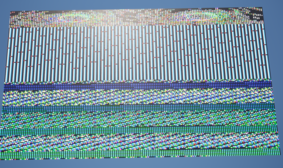

# How to Read Pixel Data from Images in Unreal Engine Using C++

In this blog post, I'll guide you through the process of reading pixel data from images in Unreal Engine using C++. This technique can be beneficial for various applications, including image processing, custom shaders, or making decisions based on image content.


# Prerequisites

Before diving into the code, ensure you have:

- A basic understanding of Unreal Engine and C++.

- Unreal Engine installed and set up.

- A project created in Unreal Engine.

# Step 1: Include Necessary Headers

First, include the necessary headers in your `.cpp` file. These headers are essential for handling textures and image data.

```cpp  

    #include "GetTexture.h"
    #include <ImageUtils.h>

#Step 2: Write the Function to Read Pixel Data
Here's the function to read pixel data from a UTexture2D object. This function will populate a TArray with FColor values representing each pixel''s color data, and it will also output the texture's width and height.

    void AGetTexture::GetPixels(UTexture2D* Texture, int32& OutWidth, int32& OutHeight)
    {
        TArray<FColor> PixelArray;

        if (!Texture || !Texture->GetPlatformData())
        {
            UE_LOG(LogTemp, Error, TEXT("Texture is null or PlatformData is missing"));
            OutWidth = 0;
            OutHeight = 0;
            return; // Return empty array to indicate an error
        }

        // Save old texture settings
        TextureCompressionSettings OldCompressionSettings = Texture->CompressionSettings;
        TextureMipGenSettings OldMipGenSettings = Texture->MipGenSettings;
        bool OldSRGB = Texture->SRGB;

        // Temporarily change texture settings for pixel reading
        Texture->CompressionSettings = TextureCompressionSettings::TC_VectorDisplacementmap;
        Texture->MipGenSettings = TextureMipGenSettings::TMGS_NoMipmaps;
        Texture->SRGB = false;
        Texture->UpdateResource();

        FTexture2DMipMap* MipMap = &Texture->PlatformData->Mips[0];
        const FColor* FormattedImageData = static_cast<const FColor*>(MipMap->BulkData.LockReadOnly());

        OutWidth = MipMap->SizeX;
        OutHeight = MipMap->SizeY;
        PixelArray.SetNum(OutWidth * OutHeight);

        for (int32 Y = 0; Y < OutHeight; Y++)
        {
            for (int32 X = 0; X < OutWidth; X++)
            {
                FColor PixelColor = FormattedImageData[Y * OutWidth + X];
                PixelArray[Y * OutWidth + X] = PixelColor;
                SpawnCubes(PixelColor, Y, X);
            }
        }

        MipMap->BulkData.Unlock();

        // Restore original texture settings
        Texture->CompressionSettings = OldCompressionSettings;
        Texture->MipGenSettings = OldMipGenSettings;
        Texture->SRGB = OldSRGB;
        Texture->UpdateResource();
    }


#Explanation of the Function
Parameters:

- UTexture2D* Texture: The texture from which you want to read pixel data.

- int32& OutWidth: Output parameter for the texture's width.

- int32& OutHeight: Output parameter for the texture's height.

#Checking Texture Validity

    if (!Texture || !Texture->GetPlatformData())
    {
        UE_LOG(LogTemp, Error, TEXT("Texture is null or PlatformData is missing"));
        OutWidth = 0;
        OutHeight = 0;
        return; // Return empty array to indicate an error
    }

This section checks if the texture is valid and if it has platform data. If either is missing, it logs an error and sets the output width and height to zero.

#Temporarily Change Texture Settings

    // Save old texture settings
    TextureCompressionSettings OldCompressionSettings = Texture->CompressionSettings;
    TextureMipGenSettings OldMipGenSettings = Texture->MipGenSettings;
    bool OldSRGB = Texture->SRGB;

    // Temporarily change texture settings for pixel reading
    Texture->CompressionSettings = TextureCompressionSettings::TC_VectorDisplacementmap;
    Texture->MipGenSettings = TextureMipGenSettings::TMGS_NoMipmaps;
    Texture->SRGB = false;
    Texture->UpdateResource();

Changing the texture settings is crucial for ensuring the pixel data is read correctly. Here’s why each setting is important:

#Compression Settings: 

Using TC_VectorDisplacementmap ensures the texture is not compressed in a way that would alter pixel values.
Mip Generation Settings: Setting MipGenSettings to TMGS_NoMipmaps ensures you are reading the highest resolution of the texture.
SRGB: Disabling SRGB ensures the color values are read linearly without gamma correction, preserving the original pixel data.

## Importance of Texture Compression

Texture compression in Unreal Engine can significantly affect image quality and pixel data accuracy. When textures are compressed, color information may be altered or reduced, leading to visual artifacts or inaccuracies in applications like image processing or shader effects.


# Visual Comparison: Compressed vs. Uncompressed Image


###Image Compressed

###Image Uncompressed


The above images demonstrate the difference between an uncompressed and compressed texture. Notice how compression make pixel data completely unrecognizable.

## Visualizing Pixel Data

To illustrate how texture settings impact pixel data, we can spawn cubes in Unreal Engine for each pixel color read from a texture.


#Locking MipMap Data

    FTexture2DMipMap* MipMap = &Texture->PlatformData->Mips[0];
    const FColor* FormattedImageData = static_cast<const FColor*>(MipMap->BulkData.LockReadOnly());

This part locks the mipmap data for reading. The mipmap stores different levels of texture detail, with level 0 being the highest resolution.

#Reading Pixel Data

    OutWidth = MipMap->SizeX;
    OutHeight = MipMap->SizeY;
    PixelArray.SetNum(OutWidth * OutHeight);

    for (int32 Y = 0; Y < OutHeight; Y++)
    {
        for (int32 X = 0; X < OutWidth; X++)
        {
            FColor PixelColor = FormattedImageData[Y * OutWidth + X];
            PixelArray[Y * OutWidth + X] = PixelColor;
        }
    }

This loop iterates over each pixel in the texture, reading the color data and storing it in the PixelArray.

#Unlocking MipMap Data

    MipMap->BulkData.Unlock();

Finally, the function unlocks the mipmap data to ensure it''s properly released after reading.

#Restoring Original Texture Settings

    Texture->CompressionSettings = OldCompressionSettings;
    Texture->MipGenSettings = OldMipGenSettings;
    Texture->SRGB = OldSRGB;
    Texture->UpdateResource();

Restoring the original texture settings ensures the texture is returned to its initial state after the pixel data is read.

---

By following these steps, you can effectively read pixel data from images in Unreal Engine using C++. This functionality opens up various possibilities for image manipulation and analysis within your Unreal Engine projects. 